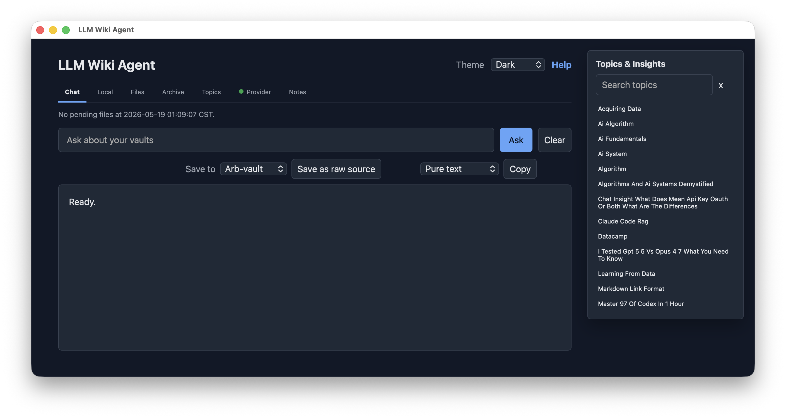

<a id="top"></a>

# LLM Wiki Agent

<p align="center">
  
</p>

## Demo Videos

### Graph View Demo 1

[Watch Graph View Demo 1](media/Graph-view-1.mov)

### Graph View Demo 2

[Watch Graph View Demo 2](media/Graph-view-2.mov)

LLM Wiki Agent is a local-first macOS app that turns Obsidian vaults into an LLM-maintained second brain. You add raw sources, ask questions, and browse in Obsidian; the app maintains the markdown wiki layer: summaries, concepts, source links, indexes, logs, archives, and notes.

An LLM is a large language model: software that can read, summarize, compare, and synthesize text. The point of an LLM Wiki is to make that work persistent. Instead of asking an LLM to rediscover the same documents every time, the agent incrementally builds a durable wiki that compounds as you add sources and ask questions.

This project implements the LLM Wiki pattern described by Andrej Karpathy: https://gist.github.com/karpathy/442a6bf555914893e9891c11519de94f

## Table Of Contents

- [What This App Does](#what-this-app-does)
- [Requirements](#requirements)
- [Clone And Install](#clone-and-install)
- [First Run Setup](#first-run-setup)
- [Vault Setup](#vault-setup)
- [Automatic Vault Bootstrap](#automatic-vault-bootstrap)
- [AI Provider Setup](#ai-provider-setup)
- [How To Use The App](#how-to-use-the-app)
- [Native macOS Features](#native-macos-features)
- [Local `.env` And `.gitignore`](#local-env-and-gitignore)
- [Clean GitHub Upload](#clean-github-upload)
- [Credits](#credits)

## What This App Does

- Watches configured Obsidian vault raw folders.
- Automatically creates required LLM Wiki files in detected vaults.
- Ingests markdown/text sources into `wiki/` pages and preserves media sources as local vault assets.
- Maintains `index.md` and `log.md`.
- Provides Chat, Local Search, Files, Archive, Topics, Provider, and Notes tabs.
- Provides a right-side topic explorer that filters by title, tag, wiki element, and updated date.
- Lets useful chat answers be saved back as raw sources.
- Supports source archive/restore and permanent archive deletion.
- Stores user notes inside related markdown files and shows note indicators in results.
- Runs as a native macOS app with a menu bar icon and a local webview UI.

[Back to top](#top)

## Requirements

- macOS 13 or later.
- Node.js 18 or later.
- Obsidian installed: https://obsidian.md
- Obsidian Web Clipper installed: https://obsidian.md/clipper
- At least one Obsidian vault configured.
- At least one AI provider configured, or Codex CLI logged in for ChatGPT subscription mode.

[Back to top](#top)

## Clone And Install

```bash
git clone https://github.com/bilalalissa/LLM-Wiki-Agent-macOS-version-1.git
cd LLM-Wiki-Agent-macOS-version-1
./scripts/build_macos_app.sh
./scripts/install_macos_app.sh
open "/Applications/LLM Wiki Agent.app"
```

The installed app copies a clean default config to:

```text
~/Library/Application Support/LLM Wiki Agent/config.env
```

Edit that file from the app menu:

```text
menu bar icon -> Open Config
```

`Open Config` opens the app config in TextEdit directly, so macOS does not ask you to choose an application for `config.env`.

[Back to top](#top)

## First Run Setup

Every time the app starts, it checks:

- Obsidian is installed.
- Obsidian Web Clipper appears to be installed.
- `VAULTS_ROOT` points to a folder with at least one Obsidian vault.
- At least one AI provider is configured.

If anything is missing, the app shows setup feedback with instructions.

[Back to top](#top)

## Vault Setup

Set `VAULTS_ROOT` to the parent folder containing your Obsidian vaults.

Example:

```text
VAULTS_ROOT=/Users/you/Documents/Obsidian-Vaults
```

Good practice: start with one dedicated LLM Wiki vault. After the workflow is comfortable, add more vaults if you want separate domains.

Example vault names:

```text
Research-vault/
Personal-vault/
Course-notes-vault/
```

The app can detect normal Obsidian vaults through their `.obsidian/` folder, and it also detects folders ending in `-vault`.

[Back to top](#top)

## Automatic Vault Bootstrap

When the app detects a vault, it automatically creates missing LLM Wiki requirements:

```text
AGENTS.md
CLAUDE.md
index.md
log.md
raw/inbox/
raw/input/
raw/processed/
raw/assets/
raw/assets/archive/
wiki/sources/
wiki/entities/
wiki/concepts/
wiki/projects/
wiki/areas/
wiki/questions/
wiki/synthesis/
wiki/maps/
wiki/archive/
templates/
```

`AGENTS.md` contains the operating schema for Codex-style agents. `CLAUDE.md` points Claude-style tools to the same schema.

[Back to top](#top)

## AI Provider Setup

Supported modes:

- `openai_subscription`: uses local Codex CLI login through `codex exec`.
- `openai`: direct OpenAI API key.
- `anthropic`: direct Anthropic API key.
- `openai_compat`: OpenAI-compatible local or hosted APIs.
- `gemini`: Gemini API key or OAuth bearer token.

For ChatGPT subscription mode:

```bash
codex login
codex login status
```

Then configure:

```text
DEFAULT_AI_PROVIDER=openai_subscription
DEFAULT_AI_MODEL=gpt-5.4
OPENAI_AUTH_METHOD=subscription
OPENAI_SUBSCRIPTION_CLIENT=codex
OPENAI_CODEX_COMMAND=codex
```

Direct OpenAI and Anthropic APIs require API credentials and separate API billing.

[Back to top](#top)

## How To Use The App

1. Put markdown, text, image, PDF, audio, or video sources into a vault's `raw/inbox/` folder.
2. Keep the app running. It auto-detects and ingests sources.
3. Browse generated pages in Obsidian under `wiki/`.
4. Use Chat for AI-assisted questions.
5. Use Local for offline wiki search.
6. Use Topics to inspect all indexed pages.
7. Use Files and Archive to manage processed sources.
8. Use Notes to manage notes attached to result text.
9. Use Provider to inspect safe provider status without exposing secrets.

Useful chat answers can be saved back into `raw/input/` and ingested like any other source.

Media ingest works as follows:

- Images, PDFs, audio, and video dropped into `raw/` or `raw/inbox/` are moved to `raw/assets/`.
- The app creates a traceable source page in `wiki/sources/`.
- Image source pages include an Obsidian embed plus a local asset link.
- Media facts are not invented. Add a description or ask the agent to inspect media before relying on observations.

The right-side Topics & Insights panel supports:

- free-text search over title, summary, tags, dates, vault, path, and wiki element
- wiki element filtering, such as source, concept, area, question, or synthesis
- tag filtering
- updated-date range filtering

[Back to top](#top)

## Native macOS Features

The native macOS wrapper provides:

- A normal app window.
- A small macOS menu bar icon.
- `Show App` from the menu bar.
- `Open Config`.
- `Open Vaults Folder`.
- `Start at Login` toggle.
- `Show Dock Icon` toggle.
- `Close Button Keeps Running` toggle.
- Startup setup checks.

`Close Button Keeps Running` is enabled by default. With it on, clicking the window close button hides the window and keeps the menu bar app and auto-ingest running in the background. Turn it off if you want the close button to quit the app. `Start at Login` may require macOS approval in System Settings.

[Back to top](#top)

## Local Env And Gitignore

The GitHub upload excludes dotfiles. After downloading the project, create local `.env` and `.gitignore` files manually if you run the Node agent directly.

See:

```text
docs/ENV_AND_GITIGNORE.md
```

The native app uses:

```text
~/Library/Application Support/LLM Wiki Agent/config.env
```

[Back to top](#top)

## Clean GitHub Upload

This repository is prepared so release uploads should not include:

- files or folders starting with `.`
- local vaults
- current user data
- API keys
- Obsidian app settings

Create a clean upload folder:

```bash
./scripts/prepare_github_release.sh
```

Upload:

```text
release-template/llm-wiki-agent/
```

[Back to top](#top)

## Credits

- LLM Wiki idea: Andrej Karpathy, `karpathy/llm-wiki.md`.
- Obsidian: https://obsidian.md
- Obsidian Web Clipper: https://obsidian.md/clipper
- OpenAI / Codex CLI for subscription-backed local agent access.
- Anthropic and Google Gemini for supported provider options.

This project is an independent local wrapper and workflow implementation. It is not affiliated with Obsidian, OpenAI, Anthropic, Google, or Andrej Karpathy.

[Back to top](#top)
